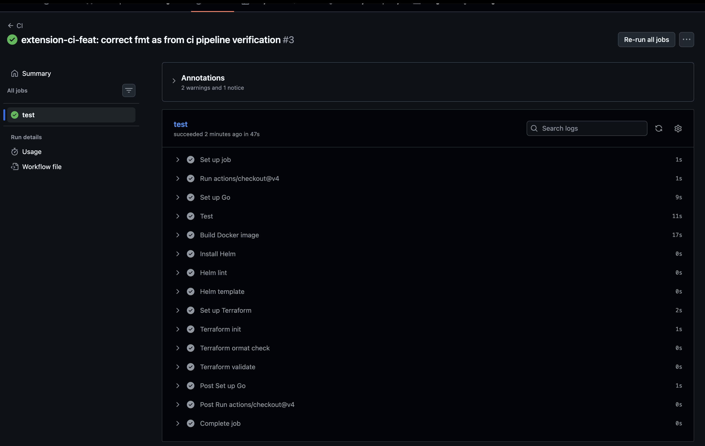

# Decisions

## 1. Container image

- Using multi-stage Docker build with a Go builder and a minimal
distroless runtime image.
- Since runtime need only compiled binary so ensure multi-stage for build and runtime purpose. A smaller runtime also reduces redundant packages and long term any security/ maintainence purpose.

## 2. Kubernetes cluster and availability

- Using kind with one control-plane and three worker nodes.
- The request only requires at least two workers, but choosing three considering
the production configuration has three replicas and want to demonstrate
one replica per worker.
- Using hard pod anti-affinity so replicas are not placed on the same node.
Trade-off is that hard anti-affinity makes scheduling more constrained.
    - If there are not enough suitable nodes, a pod remains Pending instead of being
co-located with another replica.
    - For this approach prefer predictable failure isolation over easier scheduling,
this also means a new deployment cannot simply place multiple replicas on the same
node when another suitable node is unavailable,reduce risk disrupt current traffic.

- Add a script test availability by draining a worker while sending continuous
requests. Side node as ensure on the test we cancel while drain should `kubectl uncordon "$NODE"` to release its disable as well.

## 3. Helm over Kustomize

- Choosing Helm because the application has a small number of environment-specific
values such as greeting name and replica count.
- Put consideration with Kustomize, but rejected it because overlays would add structure
that was not necessary for this small deployment. More complex and debug stuff for me.
- Just focus Deployment and Service, not make it complex too much relevant ingress and ingress controller.

## 4. Service exposure
- Using a NodePort with kind port mapping because the service must be reachable
from outside the cluster and everything runs locally.
    - My experience with assign port between local cluster with docker on machine not well so try to keep in control than reproducing network layer here to achieve purpose.
- Put consideration with Ingress, but rejected it because it would introduce another
component without adding value for this exercise.
- One limitation is that the kind host port is mapped through one node. If that
specific kind node/container is completely lost, `localhost:30080` is no
longer reachable even though Kubernetes could still have healthy replicas on
other nodes.
- For a production cluster would use a load balancer or ingress instead.
Usually that also introducing other factors:
    - Consider TLS/mTLS, certificate management, authentication, and the trust boundary between external
clients and services stuff.

## 5. Health checks and shutdown

- Using `/healthz` for startup/liveness and `/readyz` for readiness.
Following the application intended behaviour: liveness remains healthy
during warmup, while readiness becomes healthy only when the application is
ready and becomes unhealthy immediately during shutdown.

- Considering based on existing default variable can leverage but can adjust buffer termination grace period is longer than the application's shutdown delay plus drain timeout so Kubernetes has enough time for graceful shutdown.

## 6. Terraform and environments

- Choosing the Terraform Helm provider because the service is already packaged
as a Helm chart.
Using one shared Terraform configuration with:

    dev.tfvars
    prod.tfvars

- The environments differ in greeting name and replica count without duplicating
the Terraform resource configuration.Considering separate Terraform configurations for dev and prod, but rejected that because it would duplicate the deployment definition and make changes
harder to keep consistent.

- An assumption from my value here is that the exercise requires the ability to deploy the
two environments using the same configuration, rather than requiring both
environments to run simultaneously in the same cluster.
- For a real production setup, My preference give dev and prod separate state and
usually separate cluster or namespace boundaries.Avoid relying
on manually switching the same release between environment variable files.
- For CI/CD, choosing run `terraform plan` before deployment and apply only
  an approved plan. Remote state and locking would prevent concurrent changes.
  From my experience, keeping a human in the loop provides better awareness
  and control for deployment.
- If a plan is incorrect, stopping before `apply`. If a bad change is already
  applied, correct the configuration and let Terraform reconcile it. State
  recovery should use locking/backups and reconciliation rather than manually
  overwriting state.

## 7. Helm values vs Terraform values

- The Helm chart has values that can also be used directly with Helm, while
Terraform supplies the environment-specific values when Terraform manages
the release.
- This keeps the Helm package independently usable while allowing Terraform to
own the environment configuration in Task 4.
- The trade-off is that having both Helm environment values and Terraform
environment values creates a potential source of configuration drift if both
are treated as authoritative.
For production would define a clearer single source of truth for
environment configuration.
Considering as how organization manage resources differently and preference

## 8. What myself deliberately left out

Not adding:

- Ingress
- ConfigMaps or Secrets
- HPA
- PodDisruptionBudget
- NetworkPolicy
- ServiceAccount/RBAC configuration
- resource requests and limits
- production observability stack
- remote Terraform state

These were deliberately omitted because the exercise is local and
time-bounded, and they were not required to demonstrate the core deployment
and availability behaviour.

For production reconsider these based on actual operational requirements and scenarios.

## 9. Production differences

For a genuinely production-facing deployment myself would additionally consider:

- immutable image tags or image digests
- resource requests and limits
- PodDisruptionBudget
- security context and least-privilege RBAC
- NetworkPolicy
- ingress/load balancer and TLS
- autoscaling
- centralized metrics, logs and alerting
- remote Terraform state with locking
- separate state and deployment boundaries for dev and prod
- CI/CD validation and automated deployment.

The local kind environment intentionally does not try to reproduce all of
these production concerns.

## 10. Decisions I would revisit

The decisions feeling least certain about are the local NodePort exposure and
the use of hard anti-affinity.

NodePort is convenient for the exercise but is not representative of a
production traffic entry point.

Hard anti-affinity gives stronger failure isolation but can reduce scheduling
flexibility.

My preference for revisiting/ reviewing both decisions if the cluster size, availability
requirements, or traffic architecture changed.

---
## Extension order

This is my prioritisation based on operational value versus implementation
cost.

1. **CI** — validates the core artifacts on every push and gives fast feedback
   on regressions.
2. **Observability** — provides visibility into the running service and
   demonstrates an actionable alert.
3. **Survival testing** — validates the availability assumptions made in the
   Kubernetes deployment, particularly pod anti-affinity and graceful
   shutdown.
4. **GitOps** — considered valuable for a production workflow, but has the
   highest setup overhead for this local exercise and the least additional
   value compared with the other extensions.

## 11. CI Pipeline
- Added a GitHub Actions pipeline to validate the main artifacts on every push:
  Go tests, Docker build, Helm lint/template, and Terraform format/validation.
- Choosing validation over deploying the local kind cluster in CI. The Terraform
  deployment depends on the local `kind-what3words` cluster and kubeconfig,
  which are not available on a clean GitHub Actions runner.
- Considering creating a kind cluster in CI to run `terraform plan`, but
  rejected it because it would add significant setup complexity without
  providing much additional value for this CI.

## 12. Observability

- Chose Prometheus because the service already exposes Prometheus metrics.
- Kept the setup minimal: one Prometheus instance, ConfigMap, Deployment and Service.
- Used Helm to stay consistent with the Greeter deployment.
- Kept Prometheus config and alert rules as separate files under
  `helm/prometheus/config/`.

### Alert

- Alert on HTTP 5xx rate >5% for 30s instead of a single failure.
- Verified with `/boom`, which intentionally returns HTTP 500.

### Scraping

- Prometheus scrapes the Greeter Service via
  `greeter.greeter.svc.cluster.local:8080`.
- This avoids Kubernetes discovery and RBAC complexity for the exercise.
- Production would scrape individual pods using Kubernetes discovery.

### Limitations

- The error-rate denominator includes health/readiness traffic.
- Production would define the SLI around user-facing traffic and an agreed SLO.
- Exclude Grafana, Alertmanager, persistence, HA and long-term
  storage because they are unnecessary for this exercise.

## 13. Proves it survives
- Reference to section 6 under docs/task-3-note.md

## 14. Other left
- Considering Gitops complex and having no time so i skip it